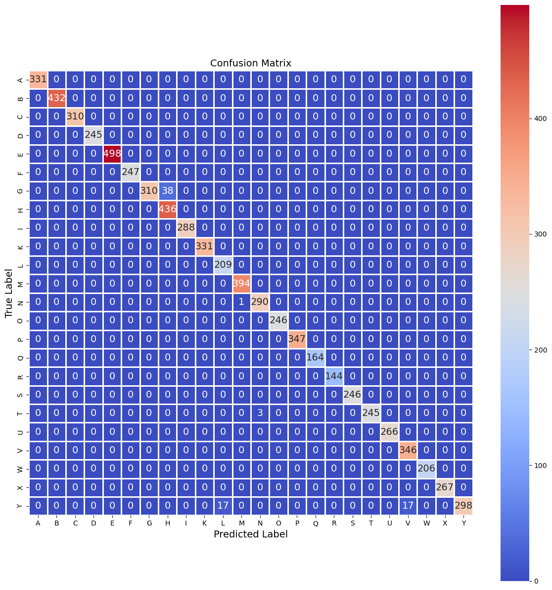
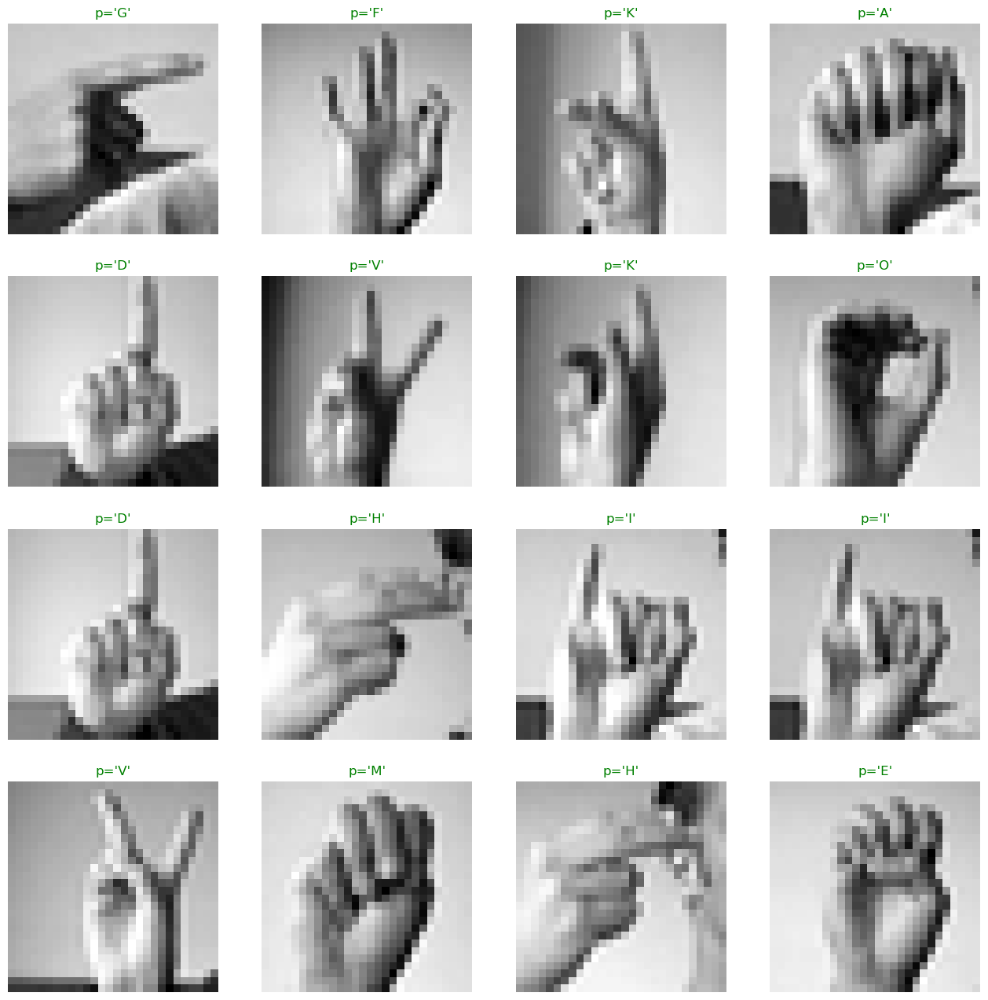

# ASL Letters Classification with `PyTorch` and Sign Language MNIST Dataset

## 🖐🏻 Overview

This project classifies **American Sign Language (ASL)** letters using a convolutional neural network (CNN). The dataset contains grayscale images of 24 ASL letters (A-Y, excluding J and Z, which require motion).

## 📄 Dataset

- **Source:** ([Kaggle link](https://www.kaggle.com/datasets/datamunge/sign-language-mnist))
- **Format:** Similar to the classic MNIST dataset
- **Classes:** 24 ASL letters (A-Y, excluding J and Z)
- **Training set:** 27,455 samples
- **Test set:** 7,172 samples
- **Image resolution:** 28x28 pixels, grayscale
- **Labels:** Represented as integers (0-25), corresponding to the letters A-Y
- **Preprocessing:** Images are _normalized_ and _reshaped_ for model input

## 📦 Environment Setup

### **Using pip (`requirements.txt`)**

```bash
pip install -r requirements.txt
```

## ⚙️ Model Architecture

The CNN model used for classification consists of:

✅ Three **convolutional layers** (with _ReLU_ activations)  
✅ **Batch normalization** for stable training  
✅ **Dropout** to prevent overfitting  
✅ **Global average pooling** for feature aggregation  
✅ Fully connected **softmax output layer** for classification

## 📊 Performance

- **Confusion Matrix**:
  

- **Predictions**:
  

- **Key Metrics**:
  - **Test Accuracy**: $98.94$%
  - **F1-Score**: $98.93$%
  - **Precision**: $99.01$%
  - **Recall**: $98.94$%

## 📈 Tracking with **Weights & Biases**

To monitor training metrics, visualize performance, and compare experiments, Weights & Biases was integrated into the training pipeline.

🔗[**View Experiment Logs on Weights & Biases**](https://wandb.ai/viathorrr/ASL%20Alphabet%20Classification%20with%20PyTorch?nw=nwuserviathorr)
